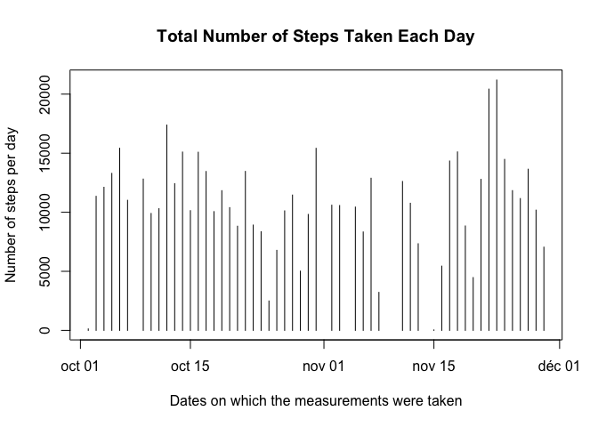
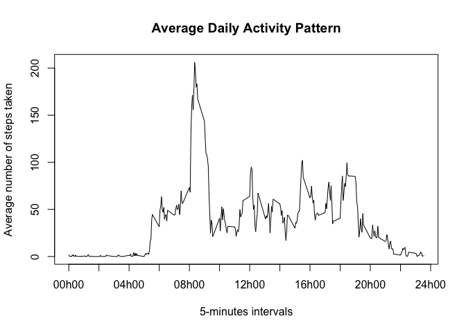
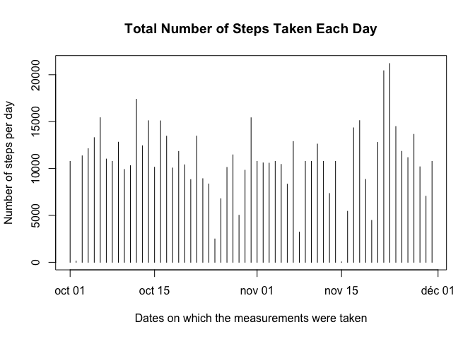
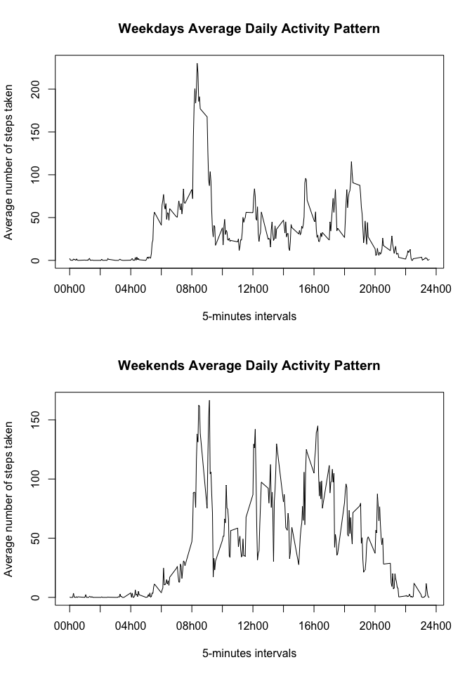

# Reproducible Research: Peer Assessment 1


## Loading and preprocessing the data
#### Load the data.

```r
# Downloading zip file if necessary.
urlZipFile <- "https://d396qusza40orc.cloudfront.net/repdata%2Fdata%2Factivity.zip"
zipFile <- "activity.zip"
filename <- file.path("./activity.csv")

if (!file.exists(zipFile)) {
  download.file(urlZipFile, zipFile, method = "curl")
}

if (!file.exists(filename)) {
  unzip(zipFile)
}
```
#### Process/transform the data (if necessary) into a format suitable for your analysis.

```r
# Loading inputSet table with all data.
inputSet <- read.table(file = filename, header = TRUE, sep = ",", na.strings = "NA")

# Assigning columns type.
inputSet$steps <- as.integer(inputSet$steps)
inputSet$date <- as.Date(inputSet$date, "%Y-%m-%d")
# Analyse of interval values: :
# 0, 5, 10, ... , 55 for the first hour of the day.
# 100, 105, 110, ... , 155 for the 2nd hour of the day.
# ...
# 2300, 2305, 2310, ... , 2355 for the last hour of the day.
# => 288 intervals per day.
inputSet$interval <- as.integer(inputSet$interval)

# Loading set including only no missing values for steps column.
noMissingStepsSet <- subset(inputSet, !is.na(inputSet$steps))
```

## What is mean total number of steps taken per day?
#### Calculate the total number of steps taken per day.

```r
plot1Set <- aggregate(. ~ date, noMissingStepsSet, sum)[, c(1, 2)]
```

#### Make a histogram of the total number of steps taken each day

```r
plot(plot1Set$date, 
     plot1Set$steps, 
     type = "h", 
     xlab = "Dates on which the measurements were taken", 
     ylab = "Number of steps per day", 
     main = "Total Number of Steps Taken Each Day")
```

<!-- -->

#### Calculate and report the mean and median of the total number of steps taken per day

```r
sprintf("Mean Total Number of Steps Taken per Day: %5.2f", mean(plot1Set$steps))
```

```
## [1] "Mean Total Number of Steps Taken per Day: 10766.19"
```

```r
sprintf("Median Total Number of Steps Taken per Day: %5.2f", median(plot1Set$steps))
```

```
## [1] "Median Total Number of Steps Taken per Day: 10765.00"
```

## What is the average daily activity pattern?
#### Make a time series plot of the 5-minute interval (x-axis) and the average number of steps taken, averaged across all days (y-axis)

```r
# Computing mean() for each interval.
meanIntervals <- aggregate(. ~ interval, noMissingStepsSet[, c(1, 3)], mean)

plot(meanIntervals$interval, 
     meanIntervals$steps, 
     type = "l",
     xaxt = "n",
     xlab = "5-minutes intervals",
     ylab = "Average number of steps taken",
     main = "Average Daily Activity Pattern")

axis(1, 
     at = c(0, 200, 400, 600, 800, 1000, 1200, 1400, 1600, 1800, 2000, 2200, 2400), 
     labels = c("00h00", "", "04h00", "", "08h00", "", "12h00", "", "16h00", "", "20h00", "", "24h00"))
```

<!-- -->

#### Which 5-minute interval, on average across all the days in the dataset, contains the maximum number of steps?

```r
sprintf("5-minutes interval %d contains the maximum number of steps (%5.2f)", 
        meanIntervals[meanIntervals$steps == max(meanIntervals$steps),]$interval,
        meanIntervals[meanIntervals$steps == max(meanIntervals$steps),]$steps)
```

```
## [1] "5-minutes interval 835 contains the maximum number of steps (206.17)"
```

## Imputing missing values
#### Calculate and report the total number of missing values in the dataset.

```r
# Looking for missing values columns.
sprintf("%2.2f%% steps values are missing.", mean(is.na(inputSet$steps)) * 100)
```

```
## [1] "13.11% steps values are missing."
```

```r
sprintf("Number of records with missing value in steps column: %d.", sum(is.na(inputSet$steps)))
```

```
## [1] "Number of records with missing value in steps column: 2304."
```

#### Devise a strategy for filling in all of the missing values in the dataset.

```r
# Loading set including only missing values for steps column.
missingStepsSet <- subset(inputSet, is.na(inputSet$steps))

# Assigning missing step values.
for (currentInterval in meanIntervals$interval) {
  missingStepsSet$steps[missingStepsSet$interval == currentInterval] <- round(meanIntervals$steps[meanIntervals$interval == currentInterval]) 
}
```

#### Create a new dataset that is equal to the original dataset but with the missing data filled in.

```r
# Merging the two sets.
fullSet <- rbind(noMissingStepsSet, missingStepsSet)
```

#### Make a histogram of the total number of steps taken each day

```r
plot2Set <- aggregate(. ~ date, fullSet, sum)[, c(1, 2)]

plot(plot2Set$date, 
     plot2Set$steps, 
     type = "h", 
     xlab = "Dates on which the measurements were taken", 
     ylab = "Number of steps per day", 
     main = "Total Number of Steps Taken Each Day")
```

<!-- -->

#### Calculate and report the mean and median total number of steps taken per day.

```r
# Calculate and report the mean and median total number of steps taken per day.
sprintf("Mean Total Number of Steps Taken per Day: %5.2f", mean(plot2Set$steps))
```

```
## [1] "Mean Total Number of Steps Taken per Day: 10765.64"
```

```r
sprintf("Median Total Number of Steps Taken per Day: %5.2f", median(plot2Set$steps))
```

```
## [1] "Median Total Number of Steps Taken per Day: 10762.00"
```

## Are there differences in activity patterns between weekdays and weekends?
#### Create a new factor variable in the dataset with two levels – “weekday” and “weekend” indicating whether a given date is a weekday or weekend day.

```r
# Difference in activity patterns between weekdays and weekends.
fullSet$dayOfWeek <- ifelse(weekdays(fullSet$date) %in% c("Samedi", "Dimanche"), "weekend", "weekday")

dayOfWeekFullSet <- aggregate(steps ~ interval + dayOfWeek, fullSet, mean)
weekdaySet <- subset(dayOfWeekFullSet, dayOfWeek == "weekday", select = c(interval, steps))
weekendSet <- subset(dayOfWeekFullSet, dayOfWeek == "weekend", select = c(interval, steps))
```

#### Make a panel plot containing a time series plot (i.e. type = "l") of the 5-minute interval (x-axis) and the average number of steps taken, averaged across all weekday days or weekend days (y-axis).

```r
par(mfrow = c(2, 1))

plot(weekdaySet$interval, 
     weekdaySet$steps, 
     type = "l",
     xaxt = "n",
     xlab = "5-minutes intervals",
     ylab = "Average number of steps taken",
     main = "Weekdays Average Daily Activity Pattern")

axis(1, 
     at = c(0, 200, 400, 600, 800, 1000, 1200, 1400, 1600, 1800, 2000, 2200, 2400), 
     labels = c("00h00", "", "04h00", "", "08h00", "", "12h00", "", "16h00", "", "20h00", "", "24h00"))

plot(weekendSet$interval, 
     weekendSet$steps, 
     type = "l",
     xaxt = "n",
     xlab = "5-minutes intervals",
     ylab = "Average number of steps taken",
     main = "Weekends Average Daily Activity Pattern")

axis(1, 
     at = c(0, 200, 400, 600, 800, 1000, 1200, 1400, 1600, 1800, 2000, 2200, 2400), 
     labels = c("00h00", "", "04h00", "", "08h00", "", "12h00", "", "16h00", "", "20h00", "", "24h00"))
```

<!-- -->
